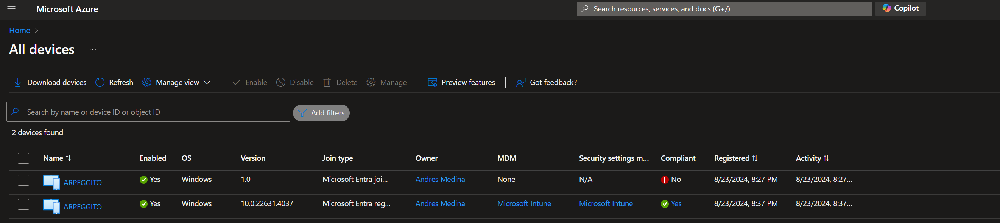
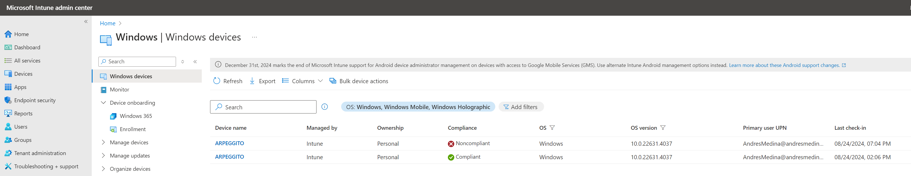

# Device Cleanup Script for Azure Entra ID and Microsoft Intune

## Overview

This script is designed to clean up duplicate devices in Azure Entra ID (formerly Azure AD) and Microsoft Intune using the Microsoft Graph API. The script identifies devices with the same name, keeps only the most recent device (based on the last contact time), and deletes the others. This helps maintain a clean and organized device inventory in your organization.

## Prerequisites

Before running this script, ensure that you have the following:

1. **Python 3.x**: The script is written in Python, so you'll need to have Python installed on your machine.
2. **Microsoft Azure Subscription**: You must have access to an Azure subscription and the necessary permissions to manage devices in Azure Entra ID and Intune.
3. **App Registration in Azure AD**: The script uses an Azure AD app registration to authenticate and access the Microsoft Graph API.

## Setup

### Step 1: Clone the Repository

First, clone this repository to your local machine:

    ```bash
    git clone https://github.com/arpeggito/Microsoft_Azure_Scripts.git
    cd Microsoft_Azure_Scripts
    ```

### Step 2: Create an Azure AD App Registration

You need to register an application in Azure AD to obtain the necessary credentials for accessing the Microsoft Graph API.

1. Go to the Azure Portal and navigate to EntraID.
2. Select App registrations and then click on New registration.
3. Enter a name for the application, e.g., "Device Cleanup Script".
4. Choose the appropriate Supported account types (Single-tenant is usually sufficient).
5. Click Register.

After application registration:
1. Note down the Application (client) ID and Directory (tenant) ID from the Overview page since this will be part of the environment variables of the script.
2. Go to Certificates & secrets and create a new Client secret. Note down the secret value as you'll need it later.
3. Go to API Permissions
4. Grant the following permissions: Device.Read.All, Device.ReadWrite.All, DeviceManagementManagedDevices.Read.All, DeviceManagementManagedDevices.ReadWrite.All, 
User.ReadWrite.All. With this permissions, the script will be able pull the EntraID and Intune device information. If you do not grant this permissions, the script will most likely fail with a 403 Forbidden error.

### Step 3: Install the required Python Libraries
Navigate to the directory where you've cloned the repository and install the necessary Python packages using pip:

    ```bash
    pip install -r requirements.txt
    ```

### Step 4: Running the script

From the terminal window run the following command:

    ```bash
    python3 ms_graph_script.py
    ```

## Explanation of the Scenario

I've configured two computers in the azure domain with the same hostname, therefore creating a duplicate. The script will identify the duplicates and remove the old device and keep the new device.

**Azure Duplicated Entries**


**Intune Duplicated Entries**


Once the script has run successfully, and cleared the duplicated device you should be able to see this in the console:


In Azure and Intune, the newest added device will be the one shown in the console.