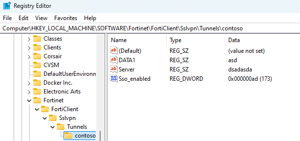
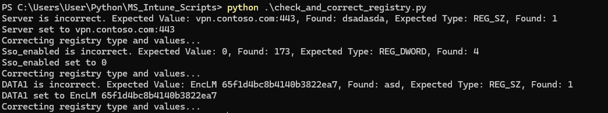
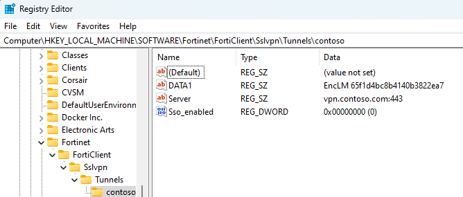
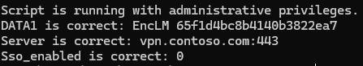

# Check and Correct Registry Script

This Python script checks and corrects specific registry keys within the Windows Registry for the Fortinet FortiClient SSL VPN settings. It ensures that the specified registry values are correctly set according to predefined expected values and types. If the values do not match, the script updates them accordingly.

## What's on this repository?

- **check_and_correct_registry.py**: Main script that checks and correct the registry keys within the Windows Registry
- **check_registry.py**: Individual script that checks the registry keys within the Windows Registry and informs if the values are correct or not.
- **correct_registry.py**: Individual script that corrects the registry keys within the Windows Registry to the expected values.
- **run_python_as_ps.ps1**: Run the check_and_correct_registry.py as PowerShell Script
- **check_correct_registry.ps1**: check_and_correct_registry.py version of the script as PowerShell Script (Since we know that the Scripts and Remediation tool accept only PowerShell Scripts)

The main script for this particular case will be check_and_correct_registry.py since is Python is the programming language I feel comfortable the most with. However, since the task explicitly requires 2 script you'll also find a 2 script version (one that checks and the other one that corrects the registry keys).

## Understanding the Intune Native Feature

The native feature used to detect and fix issues before users notice is called Scripts and Remediations. This feature is part of the Endpoint analytics in Intune and can run scripts to detect and fix issues on a user's device. Sadly will not be part of the test since it requires a Windows License Verification.


## Table of Contents

- [Prerequisites](#prerequisites)
- [How It Works](#how-it-works)
- [Usage](#usage)
- [Considerations](#considerations)
- [PowerShell](#powershell) 


## Prerequisites

- **Python 3.x**: Ensure that Python 3.x is installed on your system.
- **Reg Library**: Understand the methods used by the Reg Library: https://docs.python.org/3/library/winreg.html
- **Administrator Privileges**: Ideally the script requires Admin privileges to modify the Windows Registry.


## How It Works

### Script Functions

- **`is_admin()`**: Checks if the script is running with administrative privileges.
- **`elevate()`**: Re-runs the script with administrative privileges if it is not already elevated.
- **`correct_registry()`**: Sets a registry key to the correct value and type if it is not already set correctly.
- **`check_and_correct_registry()`**: Main function that checks the specified registry keys and corrects them if necessary.
- **`main()`**: The entry point of the script, which checks for administrative privileges and calls the necessary functions.

### Registry Path

The script targets the following registry path: "SOFTWARE\Fortinet\FortiClient\Sslvpn\Tunnels\contoso"

### Expected Registry Values

The script checks for the following keys and values:

- `Server`: Expected value is `"vpn.contoso.com:443"` (Type: `REG_SZ`)
- `Sso_enabled`: Expected value is `0` (Type: `REG_DWORD`)
- `DATA1`: Expected value is `"EncLM 65f1d4bc8b4140b3822ea7"` (Type: `REG_SZ`)

If any of these keys are missing or have incorrect values or types, the script will update them accordingly.

## Usage

Before running the script, I've manually configured on my personal computer the registry values as follows:


Therefore, we can see how the script works and it's output will look like.

1. **Clone the Repository**: First, clone this repository to your local machine:

    ```bash
    git clone https://github.com/arpeggito/Microsoft_Azure_Scripts.git
    cd Microsoft_Azure_Scripts


2. **Run the script**: To use the script, simply run it with Python from your computer:
   ```bash
   python .\check_and_correct_registry.py



Then we check the registry one more time:


We can observe that the script successfully identifies the wrong values and successfully correct them.

If the script is run and the registry contains the correct values, the script will show the following:


3. **Administrator Privileges**: If the script is not run as an administrator, it will request elevation. The script will re-run with the necessary privileges and continue executing.

### Error Handling

1. **PermissionError**: If the script does not have the required permissions to modify the registry, it will prompt the user to run the script as an administrator.

2. **FileNotFoundError**: If the registry path or specific keys are not found, the script will notify the user but continue executing for other keys.

3. **General Exceptions**: Any other exceptions are caught, and detailed information is provided to the user.

### Considerations 

- OS Compatibility: The script is designed to run on Windows systems. It will not function on non-Windows platforms.

## PowerShell

Since the idea is to run this scripts from Intune Scripts and Remediations, the script was also written in PowerShell and can be find in the repository.
If you'd like to run the PS version of the script, you can do it in your local Windows environment as follows:
   ```bash
   powershell.exe -ExecutionPolicy Bypass -File .\check_correct_registry.ps1